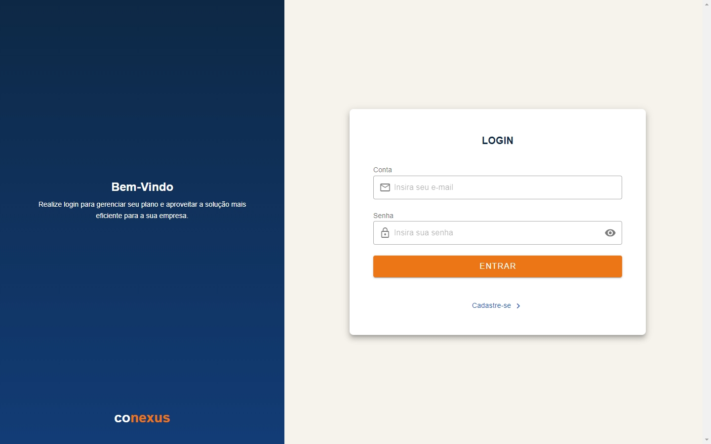
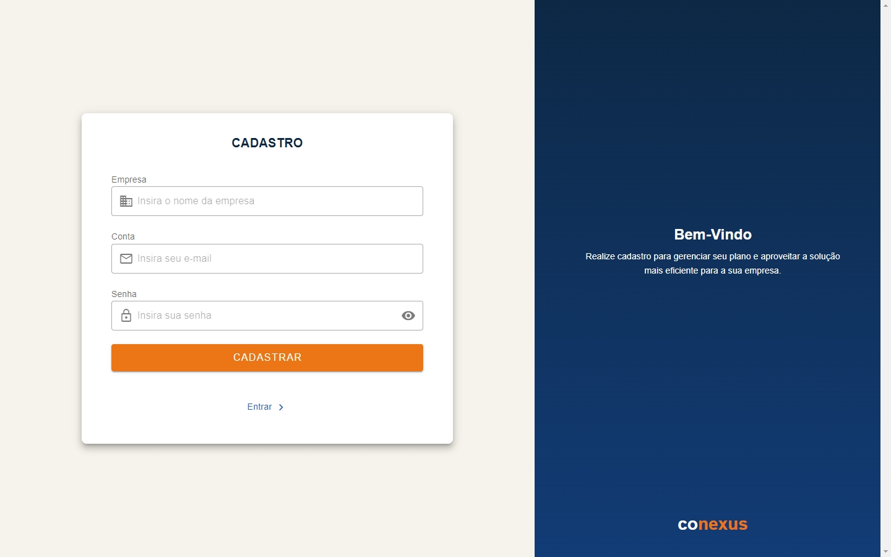
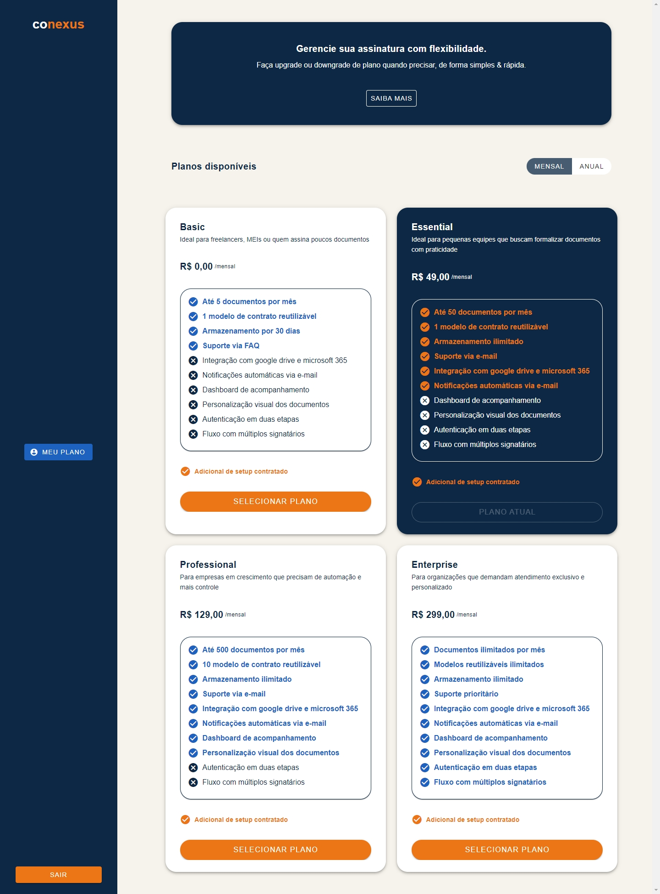
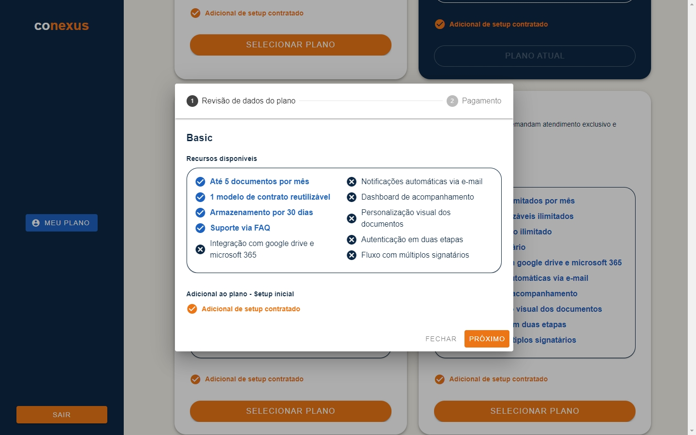
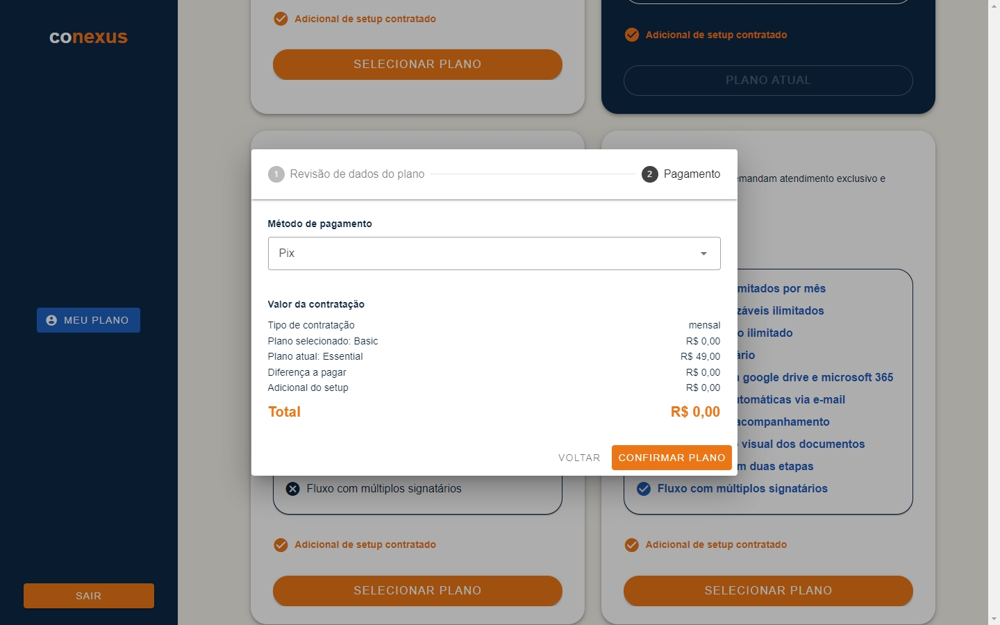
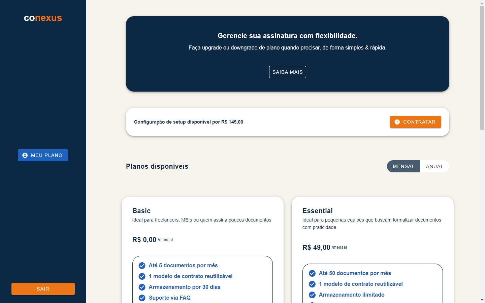

# 🚀 Conecta Suite – Teste Técnico

Este projeto representa a interface de contratação de planos de um SaaS, como parte do teste técnico da **Conecta Suite**. A aplicação foi desenvolvida com **Vue.js** e **Vuetify** para uma experiência moderna e agradável.

Além da implementação funcional, houve uma preocupação com design e usabilidade desde as etapas iniciais. Utilizou-se o Figma como ferramenta de prototipação, permitindo validar previamente a experiência do usuário (UX) e o layout da interface (UI). A identidade visual foi criada com uma paleta em laranja e azul, onde:

Laranja representa inovação, energia e ação — alinhando-se ao propósito da plataforma de facilitar contratações de forma ágil.

Azul transmite confiança, estabilidade e profissionalismo — características essenciais em uma solução SaaS voltada para empresas.

🎨 **Design e Experiência do Usuário**:
O design priorizou simplicidade e clareza, com componentes bem definidos, fluxos lineares e feedback visual claro para cada etapa da contratação. Ícones, espaçamentos e tipografia foram cuidadosamente ajustados para criar uma navegação intuitiva e agradável.

---

## 📦 Repositórios Relacionados

- [Docker-compose (Instalação local)](https://github.com/mariaeviegas/teste-conecta-suite-docker.git)  
- [Back-end (Spring Boot)](https://github.com/mariaeviegas/teste-conecta-suite-backend.git)

---

## 🚀 Como executar localmente

Siga as instruções publicadas no repositório:
🔗 https://github.com/mariaeviegas/teste-conecta-suite-docker.git

## ☁️ Produção (AWS)
O sistema também está disponível publicamente em:
🔗 http://54.242.218.64/

## 📸 Prints da Interface

### Tela Inicial  

